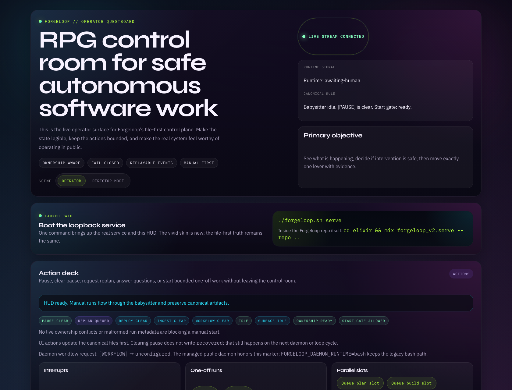
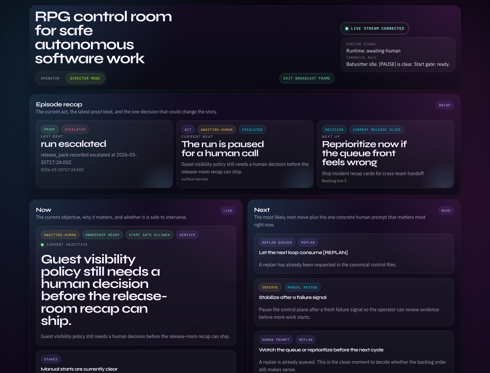

# Forgeloop

[](https://github.com/zakelfassi/Forgeloop-kit/releases/tag/v1.0.0) [](https://github.com/zakelfassi/Forgeloop-kit/tree/main/elixir)

> **Forgeloop stops coding agents from spinning.** Install it in any repo. When Claude, Codex, or any LLM agent starts thrashing on the same failure, Forgeloop pauses the run, preserves every artifact, and gives you a clean next step instead of a wasted API bill.

Forgeloop vendors into your repo and gives you:

1. **Fail-closed loops** — repeated failures become a pause and a readable handoff, not an infinite retry
2. **A live dashboard** — see what the agent is doing, what's blocking it, and what needs your attention
3. **Plain-file state** — runtime status, questions, escalations, and blockers all live in your repo as markdown and JSON
4. **One-command proof** — verify the whole system works before you trust it with real work

Works with Claude, Codex, or any LLM. Supports checklist-driven loops, structured task execution, and workflow packs.

On `main` / the v2 alpha track, you also get the live HUD, real-time event streams, the OpenClaw plugin, and a self-host proof harness. See `design.md` for the visual direction.

Today, that means **serious alpha** — strong enough to evaluate with real proof, not yet the default production runtime.

For the exact ship/no-ship bar, read `docs/v2-release-checklist.md`.

## What the product looks like

These are real screenshots from the shipped HUD, rendered against a seeded demo repo for **Signalboard** and regenerated with `./bin/capture-product-screenshots.sh`.

### Operator HUD



### Director Mode / broadcast frame



## The problem Forgeloop solves

Agent runs fail. The question is what happens next.

Without Forgeloop, your agent retries the same broken test 40 times, burns through your API budget, and leaves you with nothing useful. With Forgeloop, when the agent hits a wall:

- it **stops** instead of retrying forever
- it **preserves** every artifact and the full failure trail
- it **writes** the blocking question so you can answer on your own time
- it **pauses** cleanly so you can resume from exactly where it stopped

Forgeloop is designed to **fail closed, not spin**.

## What happens when an agent gets stuck

When a loop crosses the repeated-failure threshold, Forgeloop:

1. **Stops retrying** — no more wasted tokens
2. **Pauses the run** — writes `[PAUSE]` to `REQUESTS.md`
3. **Drafts a handoff** — a human-readable summary in `ESCALATIONS.md`
4. **Captures the blocker** — the exact question in `QUESTIONS.md`
5. **Writes machine state** — `.forgeloop/runtime-state.json` for tooling

Every piece of that chain is a plain file in your repo. You can read it, diff it, discuss it in a PR.

## Prove it in under a minute

```bash
./install.sh /path/to/target-repo --wrapper
cd /path/to/target-repo
./forgeloop.sh evals
```

The eval suite tests the things that actually matter:

- does it pause when failure repeats?
- does it escalate correctly?
- does the runtime state stay consistent?
- does auth failover work?
- does it behave the same in different repo layouts?

On the v2 alpha track, there's also a full end-to-end proof that spins up the real dashboard and drives it with a browser:

```bash
./forgeloop.sh self-host-proof
```

For release hardening on the alpha track, the repo also includes:

- `./bin/capture-product-screenshots.sh` — regenerate the public product screenshots from a seeded demo repo
- `.github/workflows/v2-alpha-proof.yml` — manual/scheduled alpha proof cadence with uploaded proof artifacts

See `evals/README.md` for details.

## Quickstart

In the target repo:

```bash
./forgeloop.sh serve
./forgeloop.sh evals
./forgeloop.sh self-host-proof                  # Optional V2 alpha release proof
./forgeloop.sh kickoff "<one paragraph project brief>"   # Fresh repo path
./forgeloop.sh plan 1
./forgeloop.sh build 10
./forgeloop.sh workflow list
```

Fresh repos now treat `PROMPT_intake.md` + `kickoff` as part of the normal lifecycle: checklist `plan` / `build` stop early when the repo still only contains bootstrap templates and point you back to the intake flow before any LLM work starts.

For continuous operation:

```bash
./forgeloop.sh daemon 300
```

That daemon is **interval-based**. It does not watch git in real time. It periodically checks the repo and control files, then decides whether to plan, build, pause, deploy, or ingest logs.

## Live dashboard (v2 alpha)

Forgeloop ships a real-time dashboard on top of the same file-backed state, so you can see and steer live runs without reading raw files:

```bash
./forgeloop.sh serve          # start the dashboard
./forgeloop.sh self-host-proof # verify it end-to-end
```

What it gives you:

- **Live state** — runtime status, blockers, questions, and ownership, updating in real time via SSE
- **Interactive controls** — pause, resume, replan, answer questions, launch one-off runs, inspect bounded parallel slots from the browser, and run one serialized write slot without leaving the HUD
- **No extra infrastructure** — no Phoenix, no database, no Node asset pipeline. Served directly by Elixir.
- **Same source of truth** — reads and writes the same repo-local files as the CLI and daemon

The dashboard also exposes a versioned API at `/api/schema` that the OpenClaw plugin uses. On the current alpha track, the same loopback surface can also expose experimental parallel slots backed by disposable worktrees:

- parallel read slots for checklist `plan` and workflow `preflight`
- one serialized write slot for checklist `build` or workflow `run`

Slot metadata lives under `.forgeloop/v2/slots/<slot-id>/...`, while repo-root runtime state stays authoritative and summarizes the coordinator.

See `docs/openclaw.md` for the plugin integration.

For launch and release-review work, keep two additional habits:

- run `./forgeloop.sh self-host-proof` before calling the alpha stack demo-ready
- regenerate the committed product screenshots with `./bin/capture-product-screenshots.sh` whenever the HUD materially changes

If you are working inside this repo directly:

```bash
cd elixir
mix forgeloop_v2.serve --repo ..
cd ..
bash bin/capture-product-screenshots.sh
```

### Supported daemon control flags

Add these anywhere in `REQUESTS.md`:

- `[PAUSE]` — pause the daemon until removed
- `[REPLAN]` — run a planning pass before continuing
- `[WORKFLOW]` — managed daemon path: run one configured workflow target via `FORGELOOP_DAEMON_WORKFLOW_NAME` and `FORGELOOP_DAEMON_WORKFLOW_ACTION` (force `FORGELOOP_DAEMON_RUNTIME=bash` to stay on the legacy daemon path)
- `[DEPLOY]` — run `FORGELOOP_DEPLOY_CMD`
- `[INGEST_LOGS]` — analyze logs into a new request

`[PAUSE]` may also be inserted automatically by Forgeloop when it escalates a repeated failure or blocker.

## Three ways to drive work

Forgeloop gives you three execution lanes depending on how structured your repo is:

1. **Checklist lane** — `IMPLEMENTATION_PLAN.md` with `./forgeloop.sh plan|build` (default)
2. **Tasks lane** — `prd.json` with `./forgeloop.sh tasks` (opt-in)
3. **Workflow lane** — native workflow packs with `./forgeloop.sh workflow ...` (experimental)

The checklist lane is the default. The dashboard, daemon, and OpenClaw plugin all surface the checklist as the canonical backlog. The tasks lane is supported but separate. The workflow lane is still manual-first and experimental.

See `docs/workflows.md` for the workflow-pack contract.

## Why teams use it

- **Drop-in** — vendors into any existing repo. No infrastructure changes, no new services to run.
- **Saves money** — stops burning API tokens on infinite retry loops
- **Reviewable** — every state change is a plain file you can diff and discuss
- **Safe defaults** — `FORGELOOP_AUTOPUSH=false`, conservative escalation thresholds, explicit opt-in for anything destructive
- **Provider-resilient** — routes between Claude and Codex with automatic auth/rate-limit failover
- **Isolation-ready** — designed for disposable VMs and containers when you run full-auto

## The runtime contract

The runtime source of truth lives in:

- `bin/loop.sh`
- `bin/forgeloop-daemon.sh`
- `bin/escalate.sh`
- `lib/core.sh`
- `lib/llm.sh`

The operator contract is documented in:

- `docs/runtime-control.md`
- `docs/workflows.md`
- `docs/sandboxing.md`

## Versioning

| Version | Status | Runtime | Pin to it |
|---------|--------|---------|-----------|
| [v1.0.0](https://github.com/zakelfassi/Forgeloop-kit/releases/tag/v1.0.0) | **Stable** | Bash | `git checkout v1.0.0` |
| `main` | **V2 alpha / development** | Elixir + Bash | `git checkout main` |

Pin to `v1.0.0` when you want the proven public release for active project work. Use `main` when you want to deliberately evaluate the richer V2 alpha operator stack: service, HUD, OpenClaw seam, managed daemon path, and self-host proof.

Beta is still future work after parity and release hardening; see `docs/release-tracks.md` and `docs/elixir-parity-matrix.md` before treating `main` as anything stronger than an alpha track. If you are iterating on the v2 alpha launch story or public/operator visuals, read `design.md` too.

The practical release bar is now explicit:

- **Alpha now:** shell/eval/Elixir/self-host proof plus reproducible product screenshots
- **Beta later:** one reviewed pass of the full checklist in `docs/v2-release-checklist.md`
- **Prod-default later still:** the managed path must earn trust without weakening the bash fallback story

Typical stable → main evaluation path inside an installed repo:

```bash
./forgeloop.sh upgrade --from /path/to/Forgeloop-kit --force
./forgeloop.sh evals
./forgeloop.sh self-host-proof
bash forgeloop/tests/run.sh
```

For the full stable-to-alpha posture, fallback guidance, rollback path, and review checklist, read `docs/v1-to-v2-upgrade.md`.

## Elixir v2 foundation

The v2 alpha track is built on an Elixir foundation in `elixir/`. It powers the live dashboard, the managed daemon, and disposable-worktree isolation — while the stable bash runtime stays available as a fallback.

Three Elixir surfaces ship today:

- `mix forgeloop_v2.serve --repo ..` — the dashboard and API service
- `mix forgeloop_v2.daemon --repo ..` — the managed daemon (checklist, workflows, deploy/ingest)
- `mix forgeloop_v2.babysit build --repo ..` — one-off runs in disposable git worktrees

All three surfaces read and write the same repo-local files. The Elixir layer does not introduce a separate database or state store.

**Coexistence:** bash and Elixir share the same ownership claim file (`.forgeloop/v2/active-runtime.json`). Running both as simultaneous active controllers is unsupported. Use `FORGELOOP_DAEMON_RUNTIME=bash` to stay on the legacy daemon path.

When v2 reaches feature parity, it will be tagged `v2.0.0-beta.1`. See `elixir/README.md`, `docs/v2-roadmap.md`, and `docs/elixir-parity-matrix.md` for the current scope.

### Runtime states

`.forgeloop/runtime-state.json` is the machine-readable source of truth.

- `status` is the coarse operator state (`running`, `blocked`, `paused`, `awaiting-human`, `recovered`, `idle`)
- `transition` carries the detailed lifecycle step (`planning`, `building`, `retrying`, `escalated`, `completed`, etc.)
- `surface` tells you which surface wrote the state (`loop`, `daemon`, etc.)
- `mode` tells you which run mode is active (`build`, `plan`, `tasks`, `daemon`, `slots`, etc.)

## Run safely

If you use auto-permissions / full-auto mode, treat the **VM or container as the security boundary**.

Disposable git worktrees are now part of the experimental self-hosting story in Elixir, but they are still a repo-internal hygiene boundary inside that VM/container, not a replacement for it.

- Guide: `docs/sandboxing.md`
- GCP runner helper: `ops/gcp/provision.sh`

Quick provision example:

```bash
OPENAI_API_KEY=... ANTHROPIC_API_KEY=... \
  ops/gcp/provision.sh --name forgeloop-runner \
  --project <gcp-project> --zone us-central1-a
```

## What it installs

Forgeloop vendors into `./forgeloop` and writes the control surfaces at repo root:

- `AGENTS.md`
- `PROMPT_intake.md`
- `PROMPT_plan.md`
- `PROMPT_build.md`
- `PROMPT_tasks.md`
- `IMPLEMENTATION_PLAN.md`
- `REQUESTS.md`
- `QUESTIONS.md`
- `STATUS.md`
- `CHANGELOG.md`
- `system/knowledge/*`
- `system/experts/*`

That gives agents and operators a consistent repo-local operating surface instead of ad hoc prompt glue.

## Secondary systems that compound

These are real capabilities, but they are not the lead story.

### Skills

Forgeloop includes Skills tooling (`skillforge`, `sync-skills`, repo-local `skills/`) so repeated workflows can become reusable procedures for Codex / Claude Code.

```bash
./forgeloop.sh sync-skills
./forgeloop.sh sync-skills --all
```

### Knowledge capture

Session hooks can load and capture durable repo-local knowledge:

```bash
./forgeloop.sh session-start
./forgeloop.sh session-end
```

### Kickoff

For greenfield projects, start with the reusable repo-local intake prompt and stay checklist-first by default.

- Hand `PROMPT_intake.md` directly to any LLM/agentic system, or
- Render a shareable prompt file with:

```bash
./forgeloop.sh kickoff "<one paragraph project brief>"
```

That generated prompt should produce `docs/*`, `specs/*`, and `IMPLEMENTATION_PLAN.md` by default. Ask for `prd.json` only when you intentionally want the tasks lane, and only seed workflow packs when you explicitly want the experimental workflow lane.

If the repo still only contains the installed bootstrap templates, `./forgeloop.sh plan` and `./forgeloop.sh build` now stop early with explicit guidance back to `PROMPT_intake.md` / `kickoff` instead of spending a low-signal checklist iteration.

### Tasks lane

If you want machine-readable task execution instead of the default markdown checklist:

> Phase-1 note: this lane is still optional and is **not** the canonical backlog surfaced by the loopback service/UI yet.


```bash
./forgeloop.sh tasks 10
```

### Log ingestion

Turn runtime logs into new requests:

```bash
./forgeloop.sh ingest-logs --file /path/to/logs.txt
```

or configure `[INGEST_LOGS]` in `REQUESTS.md` for daemon-driven ingestion.

## Install / upgrade patterns

Install into another repo from this repo:

```bash
./install.sh /path/to/target-repo --wrapper
```

If the kit is already vendored:

```bash
./forgeloop/install.sh --wrapper
```

Upgrade an existing vendored repo:

```bash
./forgeloop.sh upgrade --from /path/to/newer-forgeloop-kit --force
```

## Project layout

Key top-level paths in this repo:

- `bin/` — loop runtime, daemon, escalation, sync, kickoff, ingestion
- `lib/` — shared runtime helpers and LLM routing
- `docs/` — operator docs
- `evals/` — public proof suite
- `templates/` — installed repo surfaces
- `tests/` — broader regression suite
- `ops/gcp/` — dedicated runner provisioning

## Credits / inspiration

- [how-to-ralph-wiggum](https://github.com/ghuntley/how-to-ralph-wiggum)
- [marge-simpson](https://github.com/Soupernerd/marge-simpson)
- [compound-product](https://github.com/snarktank/compound-product)

Landing page: https://forgeloop.zakelfassi.com
